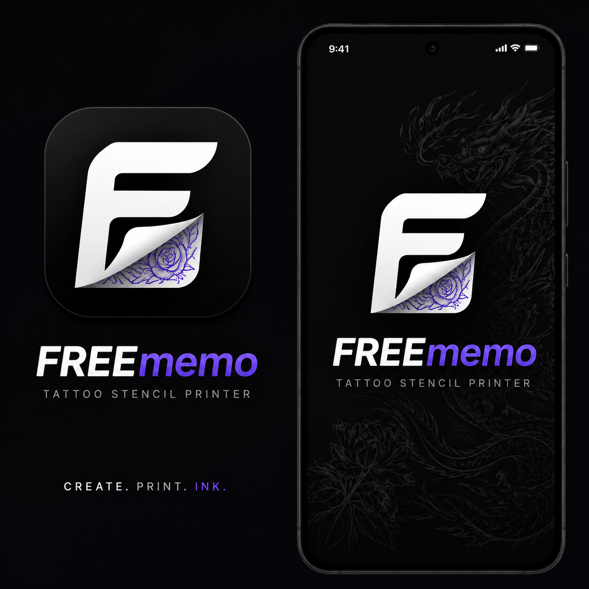
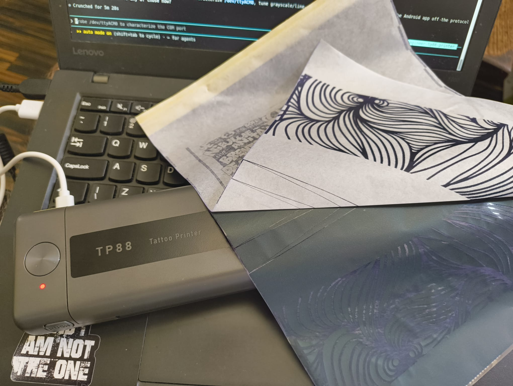

# phomemo-tp88

Reverse-engineering and a working Linux driver for the **QUIN / Phomemo TP88** thermal
tattoo-stencil printer (an M08F-class A4 unit, 203 dpi, 1728-dot head), so it can be
driven without the paywalled vendor app — and the protocol basis for the **FREEmemo**
Android app.

**Status: working over USB _and_ Bluetooth LE.** Real images print correctly both ways.
See [`docs/tp88-protocol.md`](docs/tp88-protocol.md) for the byte-level protocol and
[`docs/tp88-bluetooth.md`](docs/tp88-bluetooth.md) for the BLE transport (pairing, GATT,
flow control).

> **The FREEmemo Android app is built and printing over BLE.** A free, offline,
> no-subscription companion (customers → projects → real-world canvas → stencil prep →
> tiled BLE printing) using the protocol decoded here. It lives in its own repo
> (`android/`, kept local in this repo); the reverse-engineering findings below are what
> it's built on.



The app now covers a full stencil workflow:

- **Customers → projects → canvas** at the real-world scale of the piece, with multi-image
  layout (drag/scale/anchor/lock, semi-transparent overlap, auto-extending canvas).
- **Stencil prep** per image: photo, threshold, or Sobel **edge-detection** outlines with a
  contrast slider and line thickness; horizontal/vertical **flip**; save a processed copy.
- **Text objects**: bundled + user-added fonts (auto-indexed), preview, bold/italic, alignment,
  size, letter/line spacing, **arch** (curved) text, and **hollow** (white fill / black outline)
  lettering.
- **Background generator**: procedural 1-bit backgrounds — fractals (Mandelbrot/Julia/Newton/
  Sierpinski/Fern), mandalas, tilings (checkerboard, grids, hexagons, Truchet), Voronoi / low-poly
  / maze, curves (spirograph, rose, sunflower, ripples), recursive line fractals (Koch / Hilbert /
  dragon / Apollonian), and a wireframe **wormhole** — all with free orientation; baked as a normal
  image so every effect applies.
- **Drop shadow** and **white cutout** (sticker-style knockout) on any object; overlapping art
  merges. A **layers panel** (canvas on top, draggable list, tap-to-edit) reaches stacked objects;
  the cutout always composites last.
- **Tiled BLE printing**: pick the area, choose where it lands on the A4 sheet (to reuse half-used
  pages), set darkness and mirror, and stream to the TP88. Big pieces tile across A4 pages at a
  locked scale.
- **Backup & restore**: one offline `.freememo` file (customers, projects, images, fonts, settings)
  to share or save to Downloads, and "open with" to restore on a new phone — no cloud (Android Auto
  Backup is disabled).



*The TP88 and one of its first successful prints driven straight from Linux by this repo.*

## How it works

The TP88 exposes a USB printer-class interface (kernel `usblp` → `/dev/usb/lp0`). Its
raster language is a Luck-normal wrapper around standard ESC/POS `GS v 0` (216 bytes/line
= 1728 dots). Rather than re-derive the whole stack, this repo reuses
[TiMini-Print](https://github.com/Dejniel/TiMini-Print) (vendored as a git submodule) for
rendering and job building, and adds:

- [`src/tp88_usblp.py`](src/tp88_usblp.py) — a USB printer-class transport that writes a
  `ProtocolJob` to `/dev/usb/lp0` (TiMini-Print itself only ships Bluetooth/serial).
- [`src/tp88_print.py`](src/tp88_print.py) — a CLI: render an image/PDF/text and dump the
  bytes or send them to the printer over USB.
- [`src/tp88_ble.py`](src/tp88_ble.py) — a Bluetooth-LE transport (bleak): stream the same
  job bytes to the printer's GATT data characteristic.

TiMini-Print lists the TP88 only under "potential future support", so the exact profile
was confirmed by experiment: **`luck_a40`** (raw `GS v 0`) prints; the compressed tattoo
encoding fed blank paper.

## What we found about the TP88

- **USB identity:** `0483:5740` (STMicro STM32 VCP base), composite device, mfr `QUIN`,
  product `TP88`. IEEE-1284 ID: `CMD:XPP,XL; MDL:TP88; CLS:PRINTER; DES:LABEL PRINTER` —
  `XPP` is a proprietary raster language (not stock ESC/POS/ZPL/PCL/PS).
- **Two interfaces:** a USB **printer-class** interface (→ `usblp` → `/dev/usb/lp0`, the
  print path) and a **CDC-ACM** virtual COM port (→ `/dev/ttyACM0`, role uncharacterized —
  likely vendor diagnostic/firmware; we don't write to it).
- **Family & geometry:** matches TiMini-Print's `luck_normal_a4` family — **1728 device
  dots wide = 216 bytes/line**, 200/203 dpi, ~1600 usable dots.
- **Encoding (key result):** the printer decodes the **raw `GS v 0`** raster
  (`luck_normal_raw`, profile `luck_a40`). The **compressed** variant
  (`luck_normal_compressed`, the `luck_a4_compressed_tattoo*` profiles) made it **feed
  blank paper** — so this firmware does not implement that compression.
- **Working settings:** `--paper-mode tattoo --blackening 5` printed cleanly on tattoo
  stencil paper; geometry was full-width and correctly oriented.
- **Job shape:** Luck-normal header → one or more `1d 76 30 00 <bytes/line LE> <lines LE>`
  raster blocks → `1b 4a 90` feed + `10 ff f1 45` end. Full detail in
  [`docs/tp88-protocol.md`](docs/tp88-protocol.md).
- **Transport-agnostic:** the exact same job bytes drive the printer over **USB** and over
  **Bluetooth LE** (confirmed on hardware), so the spec maps directly to a future Android
  app (USB-OTG bulk or BLE GATT).
- **Bluetooth is BLE, not SPP:** despite advertising Classic SPP/HCRP UUIDs, the print path
  is the BLE GATT service `0xff00` (write char `0xff02`, notify `0xff03`). The printer
  **requires LE bonding** — an unbonded link is dropped after ~1 s, which is the real cause
  of "it won't pair / won't print". See [`docs/tp88-bluetooth.md`](docs/tp88-bluetooth.md).

## What TiMini-Print provides vs. what we added

- **TiMini-Print (submodule, Apache-2.0):** image/PDF/text rendering, the `luck_normal_a4`
  protocol family + `GS v 0` job building, profile catalog, and Bluetooth/serial transports.
- **This repo (ours, MIT):** the USB `usblp` transport TiMini-Print lacks, a TP88-focused
  CLI, the confirmed TP88 profile/settings, the udev access rule, and the protocol spec.

## Setup

```bash
git clone --recursive <this-repo-url> phomemo.tp88
cd phomemo.tp88
# or, if already cloned without --recursive:
git submodule update --init

python3 -m venv .venv
.venv/bin/pip install -r TiMini-Print/requirements.txt   # python-lzo is optional, skip if it fails
```

### Device access (udev)

`/dev/usb/lp0` is root-owned by default. Install the rule (grants the `plugdev` group,
which your user is typically in) and replug:

```bash
sudo cp udev/72-tp88.rules /etc/udev/rules.d/
sudo udevadm control --reload
# then unplug/replug the printer
```

## Usage

```bash
# confirmed-working print (raw GS v 0, tattoo paper, max darkness):
.venv/bin/python src/tp88_print.py examples/tinytestprint.png \
    --profile luck_a40 --paper-mode tattoo --blackening 5 --send

# inspect the exact bytes without a printer:
.venv/bin/python src/tp88_print.py examples/tinytestprint.png --profile luck_a40 --dump job.bin

# list candidate profiles:
.venv/bin/python src/tp88_print.py --list-profiles

# regenerate the synthetic test strip:
.venv/bin/python tools/make_test_strip.py tp88_test.png
```

Tuning: `--blackening 1..5` (darkness), `--paper-mode plain|tattoo|tag|black_tag|folder`,
`--rotate`, `--mirror`/`--no-mirror` (horizontal flip; **on by default for tattoo** stencils,
which go on face-down — matches the vendor driver), `--no-dither`. If a profile fed blank, try
`luck_a41_luckp` / `luck_a42_luckp` (also raw).

### Over Bluetooth LE

The same job bytes can be streamed over BLE. **Pair once** (the printer requires bonding —
see [`docs/tp88-bluetooth.md`](docs/tp88-bluetooth.md) for the full why/how), then send:

```bash
# one-time: force LE-only, enable a Just-Works agent, and bond
sudo sed -i 's/^#*\s*ControllerMode.*/ControllerMode = le/' /etc/bluetooth/main.conf
sudo systemctl restart bluetooth
bluetoothctl pairable on
bt-agent -c NoInputNoOutput &
bluetoothctl --timeout 8 scan le            # discover "TP88"
bluetoothctl pair 9B:03:D7:07:E1:DD         # -> Bonded: yes
bluetoothctl untrust 9B:03:D7:07:E1:DD      # so BlueZ doesn't hog the advertisement

# then, any time: build a job and stream it
.venv/bin/python src/tp88_print.py examples/tinytestprint.png --profile luck_a40 \
    --paper-mode tattoo --blackening 5 --dump job.bin
.venv/bin/python src/tp88_ble.py send job.bin
.venv/bin/python src/tp88_ble.py enum        # inspect the GATT services
```

The tool negotiates the printer's full ATT MTU (512 → 509-byte packets) and paces to a
target throughput (`--rate-kbps`, default 12 ≈ the print head's sustained rate, since it
drops/stalls if outrun) — a full A4 page streams in ~29 s.

## Layout

```
src/         tp88_print.py (USB CLI), tp88_ble.py (BLE), tp88_usblp.py (transport),
             qy_native.py (native command constants), qy_models.json (146-model registry)
docs/        tp88-protocol.md (USB + native protocol), tp88-bluetooth.md (BLE),
             tp88-models.md (model registry + auto-detect)
udev/        72-tp88.rules — device access rule
tools/       make_test_strip.py, make_sierpinski.py — image generators
examples/    tinytestprint.png — a sample that prints well
QY_Printer-2.1.0.3/  official QY driver — local protocol reference (gitignored, third-party)
TiMini-Print/ git submodule (Apache-2.0) — rendering + protocol engine
TODO.md      future-app backlog (from user reviews)
CLAUDE.md    working notes / project state
```

## Credits & license

Built on [TiMini-Print](https://github.com/Dejniel/TiMini-Print) by Dejniel (Apache-2.0),
included as a submodule. Our original code is MIT (see [LICENSE](LICENSE)).
